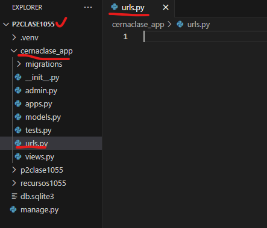
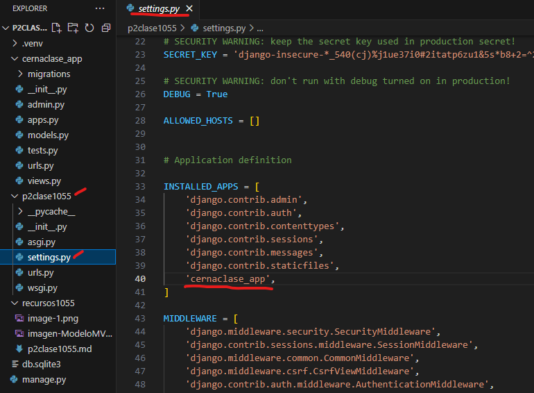
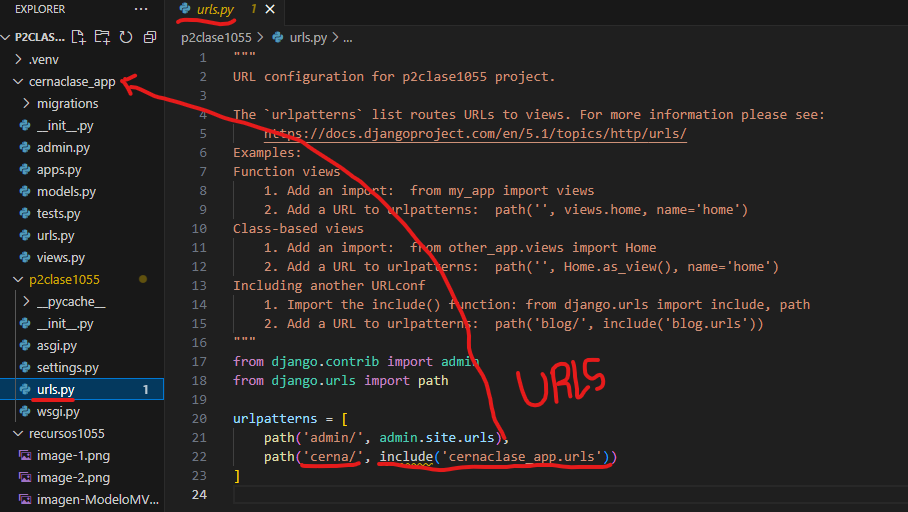
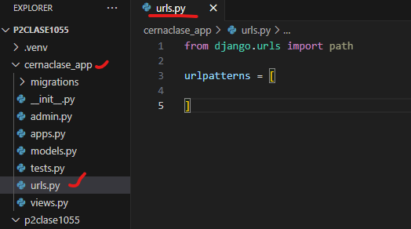
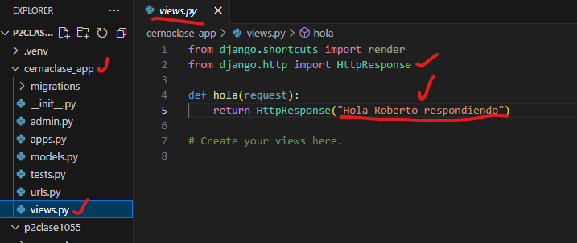
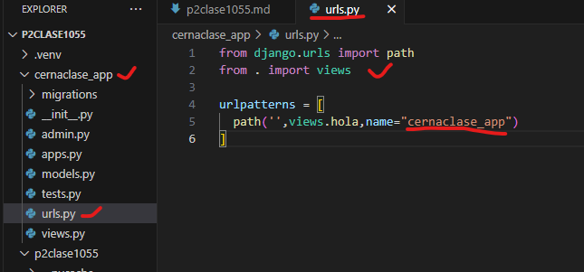

- Crear aplicación cernaclase_app
- comando --> python manage.py startapp cernaclase_app
- Creamos el archivo urls.py en cernaclase_app
- 
- En setting.py de p2clase1055 
- 
- En urls.py de p2clase1055 
- 
- En urls.py en cernaclase_app
- 
- En views.py en cernaclase_app
- 
- En urls.py en cernaclase_app
- 